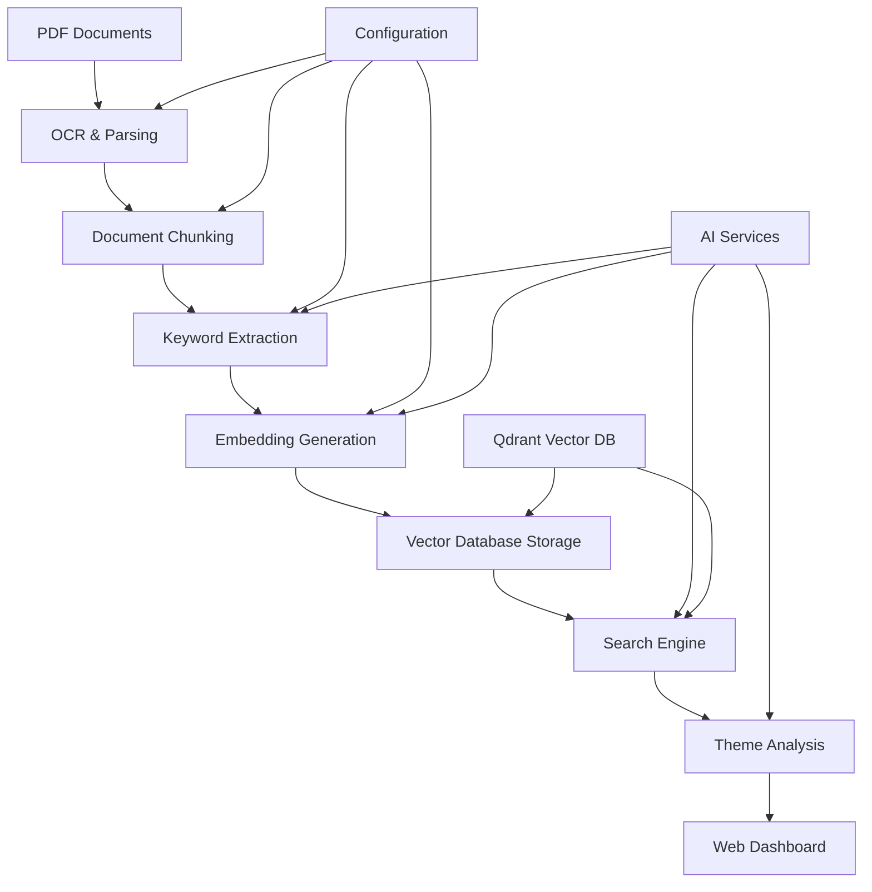

# 🤖 Advanced RAG Pipeline for Document Research & Theme Identification

## Wasserstoff AI Internship Project

A comprehensive Retrieval-Augmented Generation (RAG) system that processes documents, creates semantic embeddings, and enables intelligent search and theme analysis capabilities.

---

## 📋 Table of Contents

- [🎯 Project Overview](#-project-overview)
- [✨ Key Features](#-key-features)
- [🏗️ System Architecture](#️-system-architecture)
- [🛠️ Technology Stack](#️-technology-stack)
- [⚙️ Installation & Setup](#️-installation--setup)
- [📁 Project Structure](#-project-structure)
- [🚀 Usage Guide](#-usage-guide)
- [🔧 Configuration](#-configuration)
- [📊 Pipeline Stages](#-pipeline-stages)
- [🎯 Theme Analysis](#-theme-analysis)
- [🔍 Search & Retrieval](#-search--retrieval)
- [📈 Analytics & Monitoring](#-analytics--monitoring)
- [🐛 Troubleshooting](#-troubleshooting)
- [🤝 Contributing](#-contributing)
- [📄 License](#-license)

---

## 🎯 Project Overview

This RAG pipeline is designed to transform large collections of documents into an intelligent, searchable knowledge base. The system processes documents through multiple stages including OCR, chunking, embedding generation, and enables advanced search and theme identification capabilities.

### 🎯 Objectives

- **Automated Document Processing**: Convert PDFs and documents into structured, searchable data
- **Semantic Search**: Enable natural language queries across document collections
- **Theme Identification**: Automatically discover and analyze key themes within documents
- **Interactive Interface**: Provide user-friendly web dashboard for pipeline management
- **Scalable Architecture**: Support large document collections with efficient processing

### 🏢 Use Cases

- **Legal Document Analysis**: Process contracts, regulations, and legal documents
- **Research Paper Analysis**: Extract insights from academic publications
- **Corporate Knowledge Management**: Organize and search internal documentation
- **Compliance Monitoring**: Analyze regulatory documents and identify compliance requirements
- **Financial Document Processing**: Extract information from annual reports and financial statements

---

## ✨ Key Features

### 🔄 Complete Pipeline Automation
- **End-to-End Processing**: Automated workflow from PDF input to searchable knowledge base
- **Intelligent Error Recovery**: Robust error handling with recovery mechanisms
- **Batch Processing**: Handle multiple documents simultaneously
- **Resume Capability**: Continue processing from any stage if interrupted

### 🧠 Advanced AI Integration
- **Multi-Service Support**: Compatible with OpenAI GPT models and Google Gemini
- **Flexible Embedding Models**: Support for multiple embedding approaches
- **Intelligent Chunking**: Smart document segmentation preserving context
- **Keyword Enhancement**: Automatic keyword extraction and tagging

### 🎨 Interactive Web Dashboard
- **Real-Time Monitoring**: Live pipeline status and progress tracking
- **Visual Analytics**: Charts and metrics for processing insights
- **Search Interface**: Interactive document search with confidence scoring
- **Theme Analysis**: Visual theme identification and exploration
- **Configuration Management**: Easy setup and configuration through web UI

### 🔍 Powerful Search Capabilities
- **Semantic Search**: Natural language query processing
- **Confidence Scoring**: Reliability indicators for search results
- **Multi-Document Synthesis**: Combine information from multiple sources
- **Source Attribution**: Track and cite original document sources
- **Advanced Filtering**: Filter results by document, date, or relevance

### 📊 Comprehensive Analytics
- **Processing Metrics**: Detailed statistics on pipeline performance
- **Search Analytics**: Query patterns and result quality metrics
- **Document Insights**: Analysis of document structure and content
- **Performance Monitoring**: System resource usage and optimization insights

---

## 🏗️ System Architecture



### 🏗️ Core Components

1. **Document Processor**: OCR and text extraction from PDFs
2. **Chunking Engine**: Intelligent document segmentation
3. **Embedding Service**: Vector representation generation
4. **Vector Database**: Qdrant-based similarity search
5. **Search Engine**: Semantic query processing
6. **Theme Identifier**: Automated theme discovery
7. **Web Interface**: Streamlit-based dashboard
8. **Configuration Manager**: Environment and settings management

---

## 🛠️ Technology Stack

### 🐍 Core Technologies
- **Python 3.8+**: Primary programming language
- **Streamlit**: Web application framework


### 📄 Document Processing
- **PyMuPDF (fitz)**: PDF reading and text extraction
- **Tesseract OCR**: Optical character recognition
- **Pillow**: Image processing for OCR
- **python-docx**: Word document processing (optional)

### 🤖 AI & Machine Learning
- **OpenAI API**: GPT models for embeddings and text generation
- **Google Generative AI**: Gemini models as alternative AI service
- **scikit-learn**: Machine learning utilities and clustering
- **NumPy**: Numerical computing and array operations
- **NLTK/spaCy**: Natural language processing (optional)

### 🗄️ Data Storage & Management
- **Qdrant**: Vector database for similarity search
- **pandas**: Data manipulation and analysis
- **JSON**: Configuration and data serialization

### 📊 Visualization & UI
- **Plotly**: Interactive charts and visualizations
- **Streamlit**: Web dashboard and user interface
- **Matplotlib**: Static plotting (optional)

### 🔧 Utilities & Configuration
- **python-dotenv**: Environment variable management
- **pathlib**: File system operations
- **logging**: Comprehensive logging system
- **argparse**: Command-line interface

---

## ⚙️ Installation & Setup

### 📋 Prerequisites

1. **Python 3.8 or higher**
2. **Tesseract OCR** installed on your system
3. **Git** for cloning the repository
4. **API Keys** for AI services (OpenAI and/or Google Gemini)
5. **Qdrant** database (local or cloud)

### 🔧 System Dependencies

#### Windows
```bash
# Install Tesseract OCR
# Download from: https://github.com/UB-Mannheim/tesseract/wiki
# Add to PATH environment variable
```

#### macOS
```bash
# Install Tesseract using Homebrew
brew install tesseract
```

#### Linux (Ubuntu/Debian)
```bash
# Install Tesseract OCR
sudo apt-get update
sudo apt-get install tesseract-ocr
sudo apt-get install libtesseract-dev
```

### 🏗️ Installation Steps

1. **Clone the Repository**
```bash
git clone https://github.com/your-username/rag-pipeline.git
cd rag-pipeline
```

2. **Create Virtual Environment**
```bash
python -m venv venv

# Activate virtual environment
# Windows:
venv\Scripts\activate
# macOS/Linux:
source venv/bin/activate
```

3. **Install Python Dependencies**
```bash
pip install -r requirements.txt
```

4. **Setup Qdrant Database**

**Qdrant Cloud**
- Sign up at [Qdrant Cloud](https://cloud.qdrant.io/)
- Create a cluster and get your URL and API key

5. **Configure Environment**
```bash
# Copy environment template
cp .env.example .env

# Edit .env file with your configuration
nano .env
```

6. **Create Project Directories**
```bash
# The setup script will create these automatically
python main.py --config-check
```

---

## 📁 Project Structure

```
rag-pipeline/
├── 📄 main.py                     # Main pipeline controller
├── 📄 streamlit_app.py           # Web dashboard application
├── 📄 ocr_parsing.py             # Document processing module
├── 📄 chunking.py                # Document chunking logic
├── 📄 embeddings.py              # Embedding generation
├── 📄 search.py                  # Search engine implementation
├── 📄 theme_identifier.py        # Theme analysis module
├── 📄 connection_tester.py       # System connectivity tests
├── 📄 .env                       # Environment configuration
├── 📄 requirements.txt           # Python dependencies
├── 📄 README.md                  # Project documentation
├── 📁 docs/                      # PDF documents (input)
├── 📁 data/                      # Processed data
│   ├── 📁 processed_documents/   # OCR output
│   ├── 📁 chunked_documents/     # Chunked text
│   ├── 📁 embeddings/            # Vector embeddings
│   └── 📁 themes/                # Theme analysis results
├── 📁 logs/                      # Application logs
├── 📁 config/                    # Configuration files
│   └── 📄 settings.py            # Settings management
├── 📁 src/                       # Source modules
│   ├── 📄 __init__.py
│   ├── 📄 utils.py               # Utility functions
│   └── 📄 exceptions.py          # Custom exceptions
└── 📁 tests/                     # Unit tests
    ├── 📄 test_ocr.py
    ├── 📄 test_chunking.py
    └── 📄 test_embeddings.py
```

---

## 🚀 Usage Guide

### 🖥️ Command Line Interface

#### 🔧 Basic Setup and Configuration Check
```bash
# Check system configuration
python main.py --config-check

# Diagnose OCR issues
python main.py --diagnose-ocr

# Test connections only
python main.py --test-connections
```

#### 🏃‍♂️ Running the Complete Pipeline
```bash
# Run complete pipeline (interactive mode)
python main.py

# Run complete pipeline (automatic mode)
python main.py --auto

# Run in batch mode (no prompts)
python main.py --batch-mode

# Force reprocessing of all stages
python main.py --force
```

### 🌐 Web Dashboard

#### 🚀 Starting the Dashboard
```bash
# Start Streamlit web application
streamlit run streamlit_app.py

# Custom port
streamlit run streamlit_app.py --server.port 8080

# Production mode
streamlit run streamlit_app.py --server.headless true
```

#### 📊 Dashboard Features

**🏠 Dashboard Page**
- Pipeline status overview
- Processing metrics
- Recent activity
- Quick action buttons

**⚙️ Pipeline Management**
- Individual stage execution
- Force rerun options
- Progress monitoring
- Error reporting

**🔍 Search & Query**
- Interactive search interface
- Confidence scoring
- Source attribution
- Search history

**🎯 Theme Analysis**
- Theme identification
- Comprehensive analysis
- Visual results
- Export capabilities

**📊 Analytics**
- Processing statistics
- Performance metrics
- System status
- Resource usage

**⚙️ Settings**
- API key configuration
- Processing parameters
- Directory management
- System information

---

## 🔧 Configuration

### 📝 Environment Variables

Create a `.env` file in the project root with the following configuration:

```bash
# ===================================
# RAG Pipeline Configuration
# ===================================

# 📁 Data Directories
PDF_DIRECTORY=docs
PROCESSED_DOCUMENTS_DIR=data/processed_documents
CHUNKED_DOCUMENTS_DIR=data/chunked_documents
EMBEDDING_STORAGE_DIR=data/embeddings
THEMES_DIR=data/themes

# 🤖 AI Service API Keys
OPENAI_API_KEY=your_openai_api_key_here
GEMINI_API_KEY=your_gemini_api_key_here
GROQ_API_KEY=your_groq_api_key_here

# 🗄️ Qdrant Vector Database
QDRANT_URL=https://your-cluster-url.qdrant.io
QDRANT_API_KEY=your_qdrant_api_key
QDRANT_HOST=localhost
QDRANT_PORT=6333
COLLECTION_NAME=document_chunks

# 🧮 Embedding Configuration
EMBEDDING_MODEL=text-embedding-3-small
EMBEDDING_DIMENSION=1536
BATCH_SIZE=50

# 📄 Processing Options
USE_OCR=true
EXTRACT_KEYWORDS=true
USE_ADVANCED_NLP=true
DEDUPLICATE=true
CHUNK_SIZE=1000
CHUNK_OVERLAP=200

# 🔍 Search Configuration
TOP_K_CHUNKS=20
FINAL_CHUNKS=5
SIMILARITY_THRESHOLD=0.3

# 💬 Answer Generation
ANSWER_MODEL=gpt-3.5-turbo
MAX_CONTEXT_LENGTH=4000
TEMPERATURE=0.3

# 🔧 System Settings
DEBUG=false
LOG_LEVEL=INFO
MAX_RETRIES=3
RATE_LIMIT_DELAY=0.5
```

### 🎛️ Advanced Configuration

For advanced users, you can modify settings in `config/settings.py`:

```python
# Custom chunking parameters
CHUNK_STRATEGIES = {
    'semantic': {'size': 1000, 'overlap': 200},
    'fixed': {'size': 500, 'overlap': 100},
    'dynamic': {'min_size': 200, 'max_size': 1500}
}

# OCR configuration
OCR_CONFIG = {
    'languages': ['eng'],
    'page_segmentation_mode': 6,
    'ocr_engine_mode': 3
}

# Embedding model options
EMBEDDING_MODELS = {
    'openai': {
        'small': 'text-embedding-3-small',
        'large': 'text-embedding-3-large'
    },
    'gemini': {
        'default': 'models/embedding-001'
    }
}
```

---

## 📊 Pipeline Stages

### 1️⃣ Setup & Configuration
**Purpose**: Initialize environment and validate configuration

**Process**:
- Load environment variables
- Check dependencies
- Validate API keys
- Create directory structure
- Test database connections

**Outputs**:
- Configuration validation report
- System readiness status
- Error diagnostics

### 2️⃣ OCR & Document Parsing
**Purpose**: Extract text from PDF documents

**Process**:
- Scan PDF directory for documents
- Extract text using PyMuPDF
- Apply OCR for image-based content
- Structure text by pages and paragraphs
- Save processed text with metadata

**Outputs**:
- `data/processed_documents/*.json`: Structured text data
- Extraction metadata and statistics
- Page and paragraph mapping

**Key Features**:
- Multi-format support (PDF, images)
- OCR fallback for scanned documents
- Metadata preservation
- Error handling for corrupted files

### 3️⃣ Document Chunking
**Purpose**: Segment documents into manageable, contextual chunks

**Process**:
- Load processed documents
- Apply intelligent chunking strategies
- Preserve context across chunks
- Extract keywords for each chunk
- Cluster similar content
- Remove duplicate content

**Outputs**:
- `data/chunked_documents/*.json`: Segmented text chunks
- Keyword mappings
- Cluster assignments
- Deduplication reports

**Chunking Strategies**:
- **Semantic Chunking**: Based on meaning and context
- **Fixed-Size Chunking**: Consistent character/word limits
- **Dynamic Chunking**: Adaptive based on content structure
- **Paragraph-Aware**: Respects document structure

### 4️⃣ Keyword Extraction
**Purpose**: Enhance chunks with relevant keywords and topics

**Process**:
- Analyze chunk content for key terms
- Extract named entities
- Identify topic keywords
- Generate relevance scores
- Create keyword mappings

**Outputs**:
- Enhanced chunk data with keywords
- Keyword frequency analysis
- Topic distribution maps

**Methods**:
- TF-IDF analysis
- Named entity recognition
- AI-powered keyword extraction
- Custom domain-specific keywords

### 5️⃣ Embeddings & Vector Storage
**Purpose**: Create semantic vector representations and store in database

**Process**:
- Generate embeddings for each chunk
- Upload vectors to Qdrant database
- Create collection with metadata
- Index for fast similarity search
- Backup embeddings locally

**Outputs**:
- Qdrant vector collection
- `data/embeddings/*.json`: Embedding backups
- Vector database statistics
- Upload success reports

**Embedding Models**:
- **OpenAI**: text-embedding-3-small/large
- **Gemini**: models/embedding-001
- **Custom**: User-defined embedding models

### 6️⃣ Search & Retrieval
**Purpose**: Enable semantic search across document collection

**Process**:
- Process natural language queries
- Generate query embeddings
- Perform similarity search
- Rank and filter results
- Synthesize comprehensive answers

**Outputs**:
- Search results with confidence scores
- Source attribution and citations
- Answer synthesis
- Search analytics

**Search Features**:
- Natural language queries
- Semantic similarity matching
- Multi-document synthesis
- Confidence scoring
- Source tracking

### 7️⃣ Theme Identification
**Purpose**: Discover and analyze themes across document collection

**Process**:
- Cluster semantically similar chunks
- Identify distinct themes
- Generate theme descriptions
- Analyze theme relationships
- Create comprehensive theme reports

**Outputs**:
- `data/themes/*.json`: Theme analysis results
- Theme clustering data
- Comprehensive theme descriptions
- Theme relationship maps

**Analysis Types**:
- **Automated Theme Discovery**: Unsupervised clustering
- **Query-Based Analysis**: Themes related to specific queries
- **Comparative Analysis**: Theme evolution across documents
- **Trend Analysis**: Theme patterns and relationships

---

## 🎯 Theme Analysis

### 🧩 Theme Identification Process

The theme identification system uses advanced clustering and AI analysis to discover key themes within your document collection.

#### 🔍 Analysis Methods

**1. Semantic Clustering**
- Groups related chunks based on semantic similarity
- Uses vector embeddings for accurate clustering
- Applies multiple clustering algorithms
- Identifies optimal number of clusters

**2. AI-Powered Theme Description**
- Generates comprehensive theme descriptions
- Extracts key concepts and relationships
- Provides detailed analysis for each theme
- Creates actionable insights

**3. Cross-Document Analysis**
- Identifies themes spanning multiple documents
- Analyzes theme evolution and patterns
- Maps theme relationships and dependencies
- Provides comparative analysis

#### 📊 Theme Analysis Features

**Interactive Theme Exploration**
```python
# Example theme analysis usage
from theme_identifier import ConciseThemeIdentifier

identifier = ConciseThemeIdentifier()

# Analyze regulatory compliance themes
themes = identifier.process_query_concise(
    "regulatory compliance requirements",
    max_themes=5,
    save_results=True
)

for theme in themes:
    print(f"Theme: {theme['theme_title']}")
    print(f"Description: {theme['comprehensive_answer']}")
    print(f"Sources: {len(theme['citations'])}")
```

**Theme Visualization**
- Interactive charts showing theme distribution
- Timeline analysis for theme evolution
- Relationship networks between themes
- Keyword clouds for theme representation

**Export Capabilities**
- JSON format for programmatic access
- PDF reports for presentation
- CSV data for spreadsheet analysis
- Interactive HTML visualizations

---

## 🔍 Search & Retrieval

### 🎯 Semantic Search Engine

The search engine provides powerful natural language query capabilities across your document collection.

#### 🚀 Search Features

**Natural Language Queries**
```python
# Example search usage
from search import SemanticSearchEngine, SearchConfig

config = SearchConfig()
search_engine = SemanticSearchEngine(config)

# Perform semantic search
result = search_engine.search_and_answer(
    "What are the main compliance requirements?",
    detailed_output=True
)

print(f"Answer: {result['answer']}")
print(f"Confidence: {result['confidence']}")
print(f"Sources: {len(result['sources'])}")
```

**Advanced Search Options**
- **Confidence Thresholds**: Filter results by reliability
- **Source Filtering**: Limit search to specific documents
- **Date Range Filtering**: Search within time periods
- **Keyword Boosting**: Emphasize specific terms

#### 📊 Search Analytics

**Query Performance Metrics**
- Response time analysis
- Accuracy measurements
- Source quality assessment
- User satisfaction tracking

**Search History & Insights**
- Query pattern analysis
- Popular search terms
- Result effectiveness metrics
- Usage statistics

#### 🎯 Answer Generation

**Multi-Source Synthesis**
- Combines information from multiple documents
- Provides comprehensive, contextual answers
- Maintains source attribution
- Handles conflicting information

**Confidence Scoring**
- **Very High (90-100%)**: Direct, clear answers from reliable sources
- **High (70-89%)**: Strong supporting evidence from multiple sources
- **Medium (50-69%)**: Moderate evidence with some uncertainty
- **Low (30-49%)**: Limited or conflicting evidence
- **Very Low (0-29%)**: Insufficient or unreliable information

---

## 📈 Analytics & Monitoring

### 📊 Processing Analytics

**Pipeline Performance Metrics**
- Processing time for each stage
- Document throughput rates
- Error rates and recovery statistics
- Resource utilization monitoring

**Document Analysis Statistics**
- Document count and sizes
- Text extraction success rates
- Chunk distribution analysis
- Keyword frequency patterns

**Vector Database Metrics**
- Collection size and growth
- Search performance statistics
- Index optimization metrics
- Storage utilization data

### 🔍 Search Analytics

**Query Analysis**
- Search frequency and patterns
- Popular query types
- User behavior analysis
- Success rate measurements

**Result Quality Metrics**
- Relevance scoring distribution
- Source diversity analysis
- Answer completeness assessment
- User feedback integration

### 📈 System Health Monitoring

**Real-Time Monitoring**
- Pipeline status tracking
- Error detection and alerting
- Performance bottleneck identification
- Resource usage optimization

**Historical Analysis**
- Trend analysis over time
- Performance degradation detection
- Capacity planning insights
- Optimization recommendations

---

## 🐛 Troubleshooting

### ❗ Common Issues and Solutions

#### 🔧 Installation Issues

**Problem: Tesseract not found**
```bash
# Solution: Install Tesseract OCR
# Windows: Download from GitHub releases
# macOS: brew install tesseract
# Linux: sudo apt-get install tesseract-ocr

# Verify installation
tesseract --version
```

**Problem: Python dependencies fail to install**
```bash
# Solution: Update pip and use specific versions
pip install --upgrade pip
pip install -r requirements.txt --no-cache-dir

# For specific dependency issues
pip install --upgrade setuptools wheel
```

#### 🔑 API Configuration Issues

**Problem: OpenAI API key invalid**
```bash
# Solution: Verify API key format and permissions
# Test with curl
curl -H "Authorization: Bearer YOUR_API_KEY" \
  https://api.openai.com/v1/models
```

**Problem: Qdrant connection failed**
```bash
# Solution: Check Qdrant service status
# For local Qdrant
docker ps | grep qdrant

# For cloud Qdrant, verify URL and API key
curl -X GET "YOUR_QDRANT_URL/collections" \
  -H "api-key: YOUR_API_KEY"
```

#### 📄 Document Processing Issues

**Problem: OCR fails on PDF documents**
```bash
# Solution: Check PDF format and permissions
# Test with PyMuPDF
python -c "import fitz; doc = fitz.open('your-file.pdf'); print(len(doc))"

# For image-heavy PDFs, ensure Tesseract is configured
python main.py --diagnose-ocr
```

**Problem: Chunking produces poor results**
```python
# Solution: Adjust chunking parameters in .env
CHUNK_SIZE=800
CHUNK_OVERLAP=150
USE_ADVANCED_NLP=true
```

#### 🔍 Search Issues

**Problem: Search returns no results**
```python
# Solution: Check embeddings and similarity thresholds
# Lower the similarity threshold
SIMILARITY_THRESHOLD=0.2

# Verify embeddings exist
python -c "from embeddings import EmbeddingProcessor; 
           processor = EmbeddingProcessor(); 
           print(processor.qdrant_client.get_collection('document_chunks'))"
```

#### 🐛 Debug Mode

Enable detailed debugging:
```bash
# Set debug mode in .env
DEBUG=true
LOG_LEVEL=DEBUG

# Run with verbose output
python main.py --auto 2>&1 | tee pipeline_debug.log
```

### 🆘 Getting Help

1. **Check Logs**: Review files in `logs/` directory
2. **Run Diagnostics**: Use `python main.py --config-check`
3. **Test Connections**: Use `python main.py --test-connections`
4. **Community Support**: Check project issues on GitHub
5. **Documentation**: Refer to component-specific documentation

---

## 🤝 Contributing

### 🎯 Development Setup

1. **Fork the Repository**
2. **Create Development Environment**
```bash
git clone https://github.com/your-username/rag-pipeline.git
cd rag-pipeline
python -m venv dev-env
source dev-env/bin/activate  # or dev-env\Scripts\activate on Windows
pip install -r requirements-dev.txt
```

3. **Run Tests**
```bash
pytest tests/
python -m pytest --cov=src tests/
```

### 📝 Code Style

- Follow PEP 8 guidelines
- Use type hints where appropriate
- Add docstrings to all functions and classes
- Include unit tests for new features

### 🔄 Pull Request Process

1. Create feature branch from main
2. Implement changes with tests
3. Update documentation
4. Submit pull request with description
5. Address review feedback

### 🐛 Reporting Issues

When reporting issues, please include:
- Error messages and stack traces
- Configuration details (without API keys)
- Steps to reproduce
- System information (OS, Python version)
- Log files (if relevant)

---

## 📄 License

This project is licensed under the MIT License - see the [LICENSE](LICENSE) file for details.

### 📋 Third-Party Licenses

- **PyMuPDF**: GNU GPL v3
- **Tesseract**: Apache License 2.0
- **OpenAI API**: OpenAI Usage Policies
- **Qdrant**: Apache License 2.0
- **Streamlit**: Apache License 2.0

---

## 🙏 Acknowledgments

- **Wasserstoff AI**: For providing the internship opportunity
- **OpenAI**: For the powerful GPT and embedding models
- **Qdrant**: For the excellent vector database solution
- **Streamlit**: For the amazing web app framework
- **Open Source Community**: For the countless libraries that make this project possible

---

## 📞 Contact & Support

- **Project Maintainer**: [Your Name]
- **Email**: [your.email@example.com]
- **LinkedIn**: [Your LinkedIn Profile]
- **GitHub**: [Your GitHub Profile]

### 🔗 Useful Links

- [Wasserstoff AI](https://wasserstoff.ai/)
- [OpenAI Documentation](https://platform.openai.com/docs)
- [Qdrant Documentation](https://qdrant.tech/documentation/)
- [Streamlit Documentation](https://docs.streamlit.io/)

---

*Built with ❤️ during Wasserstoff AI Internship - Advancing the future of document intelligence and knowledge extraction*
